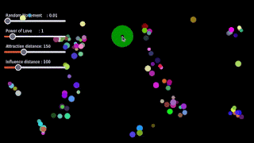

# Minds in motion

## Introduction
As I was driving to visit a friend, I started chatting with ChatGPT about a project that I've been thinking about for some time: How humans influence each other over time. What began as a simple idea soon turned into a full-fledged visual simulation—Minds in Motion.

Thanks to the power of AI, I was able to bring this concept to life in just 3 hours—from brainstorming the idea to coding, deploying, and even writing this post.

In Minds in Motion, each particle represents an individual, defined by its color and influence—either positive or negative.

- Positive influence: When a particle interacts with another, it blends its color with the other particle, representing a dynamic visual exchange.
- Negative influence: The particle darkens when interacting with a negatively charged particle, reflecting a less constructive influence.

Each particle moves randomly, creating real-time interactions that reflect the complexity of human relationships. It’s fascinating to watch these particles evolve, influence one another, and change as they "meet" in the digital space.

It’s more than just a visual—it's an exploration of how we, as humans, shape and are shaped by the connections we make. Watching these particles evolve is both mesmerizing and insightful, as it mirrors the subtle, but powerful, influence we experience in our own lives.

The best part? The entire project—from naming it, coding it, deploying it on GitHub Pages, and writing this post—was made possible with the help of AI, all in just a few hours!

🚀 Live project: https://minds-in-motion.scientific-visualization.org

Big thanks to AI for turning a passing thought on a car ride into a fully deployed project. The future is here, and it’s fast!

## How to run it with Microsoft Visual Studio Code

In Microsoft's Visual Studio Code, install the [Live Server extension](https://github.com/ritwickdey/vscode-live-server-plus-plus), right-click on one of the HTML files, and select *Open with Live Server*.

## License

Minds in Motion is available to download and use under the [Apache 2.0](https://www.apache.org/licenses/LICENSE-2.0).
